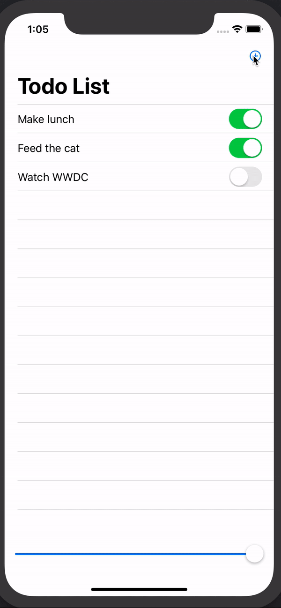

# SwiftUI Time Travel

A SwiftUI state store and view that allow you to scrub through an application's state.

This is a super rough prototype: it's only meant to serve as an example of what can be done using SwiftUI.




-----

### How this works

Any view hierarchy can use time travel: in the provided todo app, `ContentView` adds time travel like this:

```swift
struct ContentView : View {
    var body: some View {
        TimeTravelView(initialState: TodoState()) {
            TodoListView()
        }
    }
}
```

Then you can use `@EnvironmentObject` to access the state store from views within the hierarchy.

```swift
struct MyView: View {

    @EnvironmentObject var store: Store<TodoState>

    var body: some View {
        Text("Count: \(store.state.todoItems.count)")
    }
}
```

To update your application's state, use the `dispatch` method on the store:

```swift
struct MyView: View {

    @EnvironmentObject var store: Store<MyState>

    var body: some View {
        VStack(spacing: 10) {
            Text("Count: \(store.state.todoItems.count)")
            HStack(spacing: 10) {
                Button(action: { self.store.dispatch(event: .someEventName) }) {
                    Text("Do Something")
                }
            }
        }
    }
}
```

For time travel to work, all state must be accessed like this. Any state that is stored outside of the single `Store<StateType>` will not be controlled by the time travel view. This means that local view state (using `@State`) should be used sparingly (if at all).

Internally, the store keeps a stack of all states that have occured – the slider controls which of those states is used as the active (current) state.
